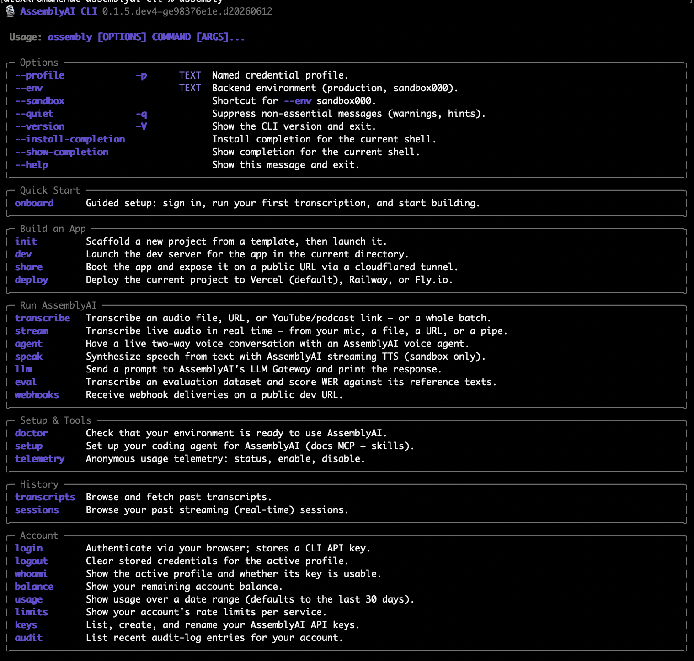

# AssemblyAI CLI

[](https://github.com/AssemblyAI/cli)
[](https://github.com/AssemblyAI/cli/blob/main/LICENSE)
[](https://www.assemblyai.com/docs)

The AssemblyAI CLI (`assembly`) brings speech AI directly into your terminal: transcribe files, URLs, YouTube/podcast pages, and whole podcast RSS feeds, stream live audio, talk to a two-way voice agent, prompt the LLM Gateway, benchmark speech models, and scaffold ready-to-deploy starter apps.

<p align="center">
  
</p>

Learn more about the platform in the [AssemblyAI docs](https://www.assemblyai.com/docs).

## ⚡ Quickstart

Install on macOS or Linux with Homebrew:

```sh
brew tap assemblyai/cli https://github.com/AssemblyAI/cli
brew trust assemblyai/cli   # only needed when HOMEBREW_REQUIRE_TAP_TRUST is set; harmless otherwise
brew install assembly
```

Sign in (stores your API key in the OS keyring) and run your first transcription:

```sh
assembly login
assembly transcribe --sample
```

That's it. Run `assembly onboard` for a guided tour, or see [Installation](#-installation) for pipx/uv and other options.

## 🚀 Why the AssemblyAI CLI?

- **🎯 One command for everything**: transcription, real-time streaming, voice agents, LLM prompts, and WER benchmarking — no SDK boilerplate.
- **🔌 Built for pipelines**: data goes to stdout, errors to stderr, `--json` gives stable machine-readable output, and `-` reads audio from stdin.
- **🔐 Secure by default**: your API key lives in the OS keyring, never in a dotfile — and run commands have no `--api-key` flag, so keys can't leak into `ps` or shell history.
- **🛠️ From demo to deployed app**: `assembly init` scaffolds a runnable FastAPI starter, `assembly dev` / `share` / `deploy` run, tunnel, and ship it, and `--show-code` prints the equivalent Python SDK script for any run command (`transcribe` / `stream` / `agent` / `agent-cascade`).
- **🤖 Agent-ready**: `assembly setup install` wires your coding agent up with the AssemblyAI docs MCP server and skills.
- **📖 Open source**: MIT licensed.

## 📋 Features at a glance

| Command | What it does |
| :--- | :--- |
| `assembly transcribe` | Transcribe files, URLs, YouTube/podcast pages, podcast RSS feeds, directories, globs, or bucket storage (`s3://`, `gs://`, `az://`) — with speaker labels, PII redaction, summarization, SRT/VTT captions, and resumable batch runs |
| `assembly stream` | Real-time transcription from your microphone, a file, or a URL — on macOS it can capture system audio too |
| `assembly dictate` | Signal-driven dictation: records immediately, send SIGTERM for instant text — scriptable from hotkey tools like Hammerspoon (Sync STT API, up to 120 s per utterance) |
| `assembly agent` | Full-duplex spoken conversation with a voice agent, right in your terminal |
| `assembly agent-cascade` | Same live conversation, but wired client-side from Streaming STT + the LLM Gateway + streaming TTS, like the `agent-cascade` starter (sandbox-only) |
| `assembly speak` | Synthesize text to speech over the streaming-TTS WebSocket (sandbox-only) |
| `assembly llm` | Prompt the LLM Gateway over a transcript, files, stdin, or a live stream |
| `assembly clip` | Cut audio/video with ffmpeg by diarized speaker, text match, LLM pick, or time range (`--video` keeps the picture for URL sources) — clip boundaries snap into nearby silence |
| `assembly dub` | Re-voice an audio/video file or URL in another language: transcription, LLM translation, per-speaker TTS, ffmpeg track-swap (sandbox-only) |
| `assembly caption` | Burn always-visible captions into a video: transcribe (or reuse a transcript), fetch SRT, ffmpeg burns it in — audio untouched |
| `assembly eval` | Benchmark WER against Hugging Face datasets (built-in aliases: `librispeech`, `tedlium`, …) or local manifests |
| `assembly webhooks listen` | Open a public dev URL that prints webhook deliveries and can forward them to your local app |
| `assembly init` / `dev` / `share` / `deploy` | Scaffold a FastAPI + HTML starter app, run it locally, expose it on a public URL, ship it to Vercel / Railway / Fly.io |
| `assembly setup` | Wire a coding agent up with the AssemblyAI docs MCP server and skills |
| `assembly doctor` | Check your environment: API key, network, ffmpeg, microphone |
| `assembly transcripts` / `sessions` | Browse and fetch past transcripts and streaming sessions |
| `assembly keys` / `balance` / `usage` / `limits` / `audit` | Account self-service via browser login |

Add `--show-code` to `transcribe` / `stream` / `agent` / `agent-cascade` to print the equivalent Python SDK script instead of running — the built-in path from CLI experiment to SDK code.

## ✨ Things you can do with it

A few one-liners that show what `assembly` can do. The everyday basics live under [Getting started](#-getting-started) below.

> [!NOTE]
> `speak` and `dub` are sandbox-only today — that's why the examples below pass `--sandbox`.

**Recreate a scene with synthetic voices** — transcribe and diarize a YouTube clip, then pipe it straight into TTS with a different voice per speaker:

```sh
assembly transcribe "https://www.youtube.com/watch?v=awmCtXzFsJo" --speaker-labels \
  | assembly --sandbox speak --voice A=jane --voice B=mary --out scene.wav
```

`speak` auto-detects `Speaker A:` labels, merges each speaker's turns, and rotates voices.

**Dub a video into another language** — the whole platform in one command: transcription with utterance timestamps, per-utterance LLM translation, TTS for each line (one voice per speaker), and ffmpeg laying the new track over the original video. A great demo is the first YouTube video ever, "Me at the zoo" — it's 19 seconds long, a single clear English speaker, and instantly recognizable, so the dub finishes fast and the before/after is obvious:

```sh
assembly --sandbox dub "https://www.youtube.com/watch?v=jNQXAC9IVRw" -l de --video
```

The video stream is copied untouched; each dubbed line lands at its original start time.

**Turn a podcast into audio** — Apple and Spotify podcast pages work too (yt-dlp ingestion):

```sh
assembly transcribe "https://podcasts.apple.com/us/podcast/id1516093381" --speaker-labels \
  | assembly --sandbox speak --out episode.wav
```

**Cut the highlight reel from a speech** — `clip` downloads the video (`--video`; omit it for audio-only clips), transcribes it, has an LLM pick the windows, and cuts each one into its own file with ffmpeg (here: Steve Jobs' Stanford commencement address):

```sh
assembly clip "https://www.youtube.com/watch?v=UF8uR6Z6KLc" --video \
  --llm "the most quotable 20-40 seconds from each of the stories" \
  --padding 0.5 --out-dir .
```

**Burn karaoke subtitles into a music video** — `caption` transcribes the video and burns the captions straight into the picture with ffmpeg; `--chars-per-caption` keeps the lines short so they flip with the vocals:

```sh
assembly caption video.mp4 --chars-per-caption 24 --font-size 28
```

`clip`, `dub`, and `caption` each batch a piped list too: `--from-stdin` reads one path/URL per line and processes them concurrently (`--concurrency`), skipping sources whose output already exists so a re-run only does what's left (`--force` redoes them):

```sh
find talks -name "*.mp4" | assembly caption --from-stdin --concurrency 3
```

**Keep a live to-do list from your mic** — `llm -f` re-runs the prompt over the growing transcript, updating in place:

```sh
assembly stream -o text | assembly llm -f "summarize my to-dos as I talk"
```

**Caption a meeting from system audio** (macOS) — captures app/system audio alongside your mic as separate diarized speakers:

```sh
assembly stream --system-audio --speaker-labels -o text
```

**Build a WisprFlow clone** — `assembly dictate` records on launch and prints the transcript on SIGTERM, so a hotkey tool can drive push-to-talk dictation that types into any app. The [`examples/wisprflow-hammerspoon`](examples/wisprflow-hammerspoon) recipe wires it up with [Hammerspoon](https://www.hammerspoon.org): hold a hotkey, speak, release, and the text lands at your cursor.

**Get pinged when your name comes up** in a live meeting:

```sh
assembly stream -o text | grep --line-buffered -i alex \
  | while read -r _; do afplay /System/Library/Sounds/Glass.aiff; done
```

**Chain LLM prompts over a transcript** — each prompt runs on the finished transcript:

```sh
assembly transcribe --sample --llm "summarize" --llm "translate the summary to French"
```

**Score diarization quality across several videos** — pass a hand-picked list of URLs straight on the command line (batch mode), transcribe them in parallel with speaker labels, have an LLM judge each transcript, then use `--llm-reduce` to run one prompt over all the results for a single aggregate verdict:

```sh
assembly transcribe \
  https://youtu.be/RC5zRvqnRm8 \
  https://youtu.be/u9S41Kplsbs \
  https://youtu.be/mP31CdpGzUY \
  --concurrency 3 --speaker-labels \
  --llm 'Judge diarization quality; output JSON {speaker_count, issues, score}' \
  --llm-reduce 'Rank these videos worst-to-best and summarize the failure modes'
```

(Prefer to stream a generated list in? `--from-stdin` reads one source per line, so `find . -name '*.wav' | assembly transcribe --from-stdin …` works too.)

**Map-reduce a batch of talks** — extract structured notes from each video (`--llm`, a map), then reduce across all of them with a stronger model (`--model`):

```sh
assembly transcribe \
  https://youtu.be/LCEmiRjPEtQ \
  https://youtu.be/1yvBqasHLZs \
  https://youtu.be/MiqLoAZFRSE \
  https://youtu.be/s7_NlkBwdj8 \
  https://youtu.be/60iW8FZ7MJU \
  https://youtu.be/V979Wd1gmTU \
  --concurrency 6 \
  --llm 'Extract JSON {thesis, key_claims[]}' \
  --llm-reduce 'Where do the speakers disagree?' --model claude-opus-4-7
```

**Summarize your recent transcripts and surface the themes** — pipe a list of past transcripts into `transcripts get`, summarize each (`--llm`, a map), then reduce them all into one answer (`--llm-reduce`):

```sh
assembly transcripts list --json --limit 5 \
| assembly transcripts get \
    --llm "Summarize this transcript" \
    --llm-reduce "What are the top themes in these transcripts?"
```

**Talk to a voice agent in your terminal** — full-duplex, around 20 voices:

```sh
assembly agent --voice ivy --system-prompt "you're a helpful interviewer"
```

**Graduate to the SDK** — `--show-code` prints the equivalent Python script for any `transcribe`/`stream`/`agent`/`agent-cascade` run instead of executing it:

```sh
assembly agent --system-prompt "you're a story generator" --show-code > story.py
```

**Scaffold and deploy a voice agent** — templates: `voice-agent`, `audio-transcription`, `live-captions`:

```sh
assembly init voice-agent && assembly deploy --prod
```

**Benchmark WER against public datasets** — built-in aliases for LibriSpeech, TEDLIUM, and more:

```sh
assembly eval librispeech --speech-model universal-3-pro --limit 50
```

Add `--llm` to run an LLM-Gateway chain over each transcript (the WER score still
uses the raw transcript), and `--llm-reduce` to run one prompt over every item's
result and summarize the errors across the whole run:

```sh
assembly eval tedlium --limit 50 --llm-reduce "Summarize the common error patterns"
```

## 📦 Installation

Requires Python 3.12+ (Homebrew brings its own; for pipx/uv see the `--python` hint below).

> [!WARNING]
> The `assemblyai-cli` package on PyPI is **not** this project — install with one of the
> commands below, not `pip install assemblyai-cli`.

### Homebrew (recommended — macOS / Linux)

```sh
brew tap assemblyai/cli https://github.com/AssemblyAI/cli
brew trust assemblyai/cli   # only needed when HOMEBREW_REQUIRE_TAP_TRUST is set; harmless otherwise
brew install assembly
```

Homebrew pulls in `ffmpeg` and `portaudio`, so every command works out of the box.

### pipx / uv

```sh
pipx install "git+https://github.com/AssemblyAI/cli.git"
# or
uv tool install "git+https://github.com/AssemblyAI/cli.git"
```

If your default interpreter is older than Python 3.12, add `--python python3.12` (pipx) or
`--python 3.12` (uv) to the install command.

<details>
<summary>System dependencies for the live-audio commands (pipx/uv installs only)</summary>

Only the live-audio commands need anything extra: `stream`, `dictate`, and `agent` use PortAudio for
microphone capture and [`ffmpeg`](https://ffmpeg.org) on `PATH` to stream non-WAV audio.
Plain `transcribe` uploads your file directly and needs neither.

- Debian/Ubuntu: `sudo apt-get install libportaudio2 ffmpeg`
- Fedora: `sudo dnf install portaudio ffmpeg`
- macOS (Homebrew): `brew install portaudio ffmpeg`

</details>

## 🔐 Authentication

New to AssemblyAI? Create a free account at
[assemblyai.com/dashboard](https://www.assemblyai.com/dashboard) to get an API key.

### Option 1: Browser login (recommended)

**✨ Best for:** day-to-day use on your own machine.

Browser login stores your API key in the OS keyring (Keychain / Credential Manager / Secret Service) — nothing lands in a dotfile, and it unlocks the account commands (`keys`, `balance`, `usage`, `limits`, `sessions`, `audit`):

```sh
assembly login
```

### Option 2: API key environment variable

**✨ Best for:** CI, containers, and anywhere a browser isn't an option.

The environment variable is checked before the keyring, and nothing is written to disk:

```sh
export ASSEMBLYAI_API_KEY="YOUR_API_KEY"
```

## 🚀 Getting started

### Guided tour

Sign in, run a first transcription, start building:

```sh
assembly onboard
```

### Basic usage

```sh
assembly transcribe --sample   # transcribe the hosted sample file
assembly transcribe call.mp3   # then your own audio
assembly stream --sample       # live streaming, no microphone needed
assembly stream                # stream your microphone (Ctrl-C to stop)
assembly agent                 # talk to a voice agent (use headphones)
assembly init                  # scaffold a starter app
```

### Quick examples

Pull exactly the output you need:

```sh
assembly transcribe call.mp3 -o text   # just the text
assembly transcribe video.mp4 -o srt   # captions
assembly transcribe call.mp3 --speaker-labels --summarization --json
```

Transcribe in batches — a hand-picked list, a directory, a glob, a piped list,
or a whole podcast RSS feed (every episode becomes one source), resumable on
re-run:

```sh
assembly transcribe a.mp3 b.mp3 https://youtu.be/dtp6b76pMak   # a hand-picked list
assembly transcribe ./recordings
assembly transcribe "s3://bucket/calls/*.mp3"   # needs: pip install s3fs
assembly transcribe "https://feeds.simplecast.com/54nAGcIl"   # every episode in the feed
find . -name "*.wav" | assembly transcribe --from-stdin
```

Compose with other tools — audio in, text out:

```sh
ffmpeg -i talk.mp4 -f wav - | assembly transcribe -
git log --oneline -30 | assembly llm "write release notes grouped by feature/fix"
```

Pass files — or a whole directory — straight to `llm` instead of building the pipeline yourself — each is read, prefixed with a `===== name =====` header, and concatenated as the prompt's context (so the answer can cite which note it came from). A directory argument recurses for its `.md`/`.txt` files:

```sh
assembly llm "answer using only these notes: who owns the deploy?" notes/*.md
assembly llm "summarize the key decisions" transcripts/
```

## 📚 Documentation

### In the terminal

- Run `assembly --help` or `assembly <command> --help` for flags and examples.
- Run `assembly doctor` to check your environment (API key, network, ffmpeg, microphone).

### Resources

- [**AssemblyAI docs**](https://www.assemblyai.com/docs) — guides for every model and feature.
- [**API reference**](https://www.assemblyai.com/docs/api-reference) — the REST and streaming APIs the CLI drives.
- [**Dashboard**](https://www.assemblyai.com/dashboard) — manage your account and API keys.

## 🤝 Contributing

This project uses [uv](https://docs.astral.sh/uv/):

```sh
uv sync                  # create/refresh the venv
uv run assembly --help   # run the CLI from the locked environment
./scripts/check.sh       # the full gate CI runs
```

See [AGENTS.md](AGENTS.md) for development conventions and architecture notes.

## 📄 Legal

- **License**: released under the [MIT license](LICENSE).
- **Privacy**: [AssemblyAI privacy policy](https://www.assemblyai.com/legal/privacy-policy) — the CLI's anonymous usage telemetry is opt-out (`assembly telemetry disable`, `AAI_TELEMETRY_DISABLED=1`, or `DO_NOT_TRACK=1`).
- **Terms**: [AssemblyAI terms of service](https://www.assemblyai.com/legal/terms-of-service).
